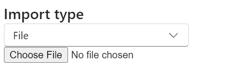
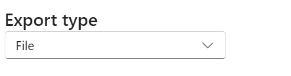
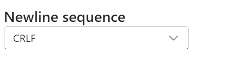

# CSV Import+Export Help Page

## Import CSV

The Import CSV pane contains options for importing CSV data to your workbook.

Here is a sample CSV to test out the app:

```
name,size
delimiter.webp,5826
encoding.webp,6270
importType.webp,11070
newlineSequence.webp,6686
numberFormat.webp,6094
```

1. Import type dropdown and input

- Upload a file or select "Text input" to paste the CSV as text



2. Encoding dropdown

- Most files will be imported correctly with "Auto-detect", but you may have to select the correct encoding if the result does not look correct
- This dropdown is available if Import type is File


3. Delimiter dropdown

- The delimiter is the field separator between each cell
- Select "Other" to input a custom delimiter


4. Newline sequence dropdown

- The newline sequence is the record separator between each row
- "Auto-detect" will most likely be able to figure it out


5. Number format dropdown

- "Text" will import data from the CSV file as the Text number format. This means that text will not be converted into other formats such as date or currency.
- "Auto-detect" will import data from the CSV file as the General number format. This means that the data may be converted into other number formats such as date or currency.
    - A cell containing `1-1` will become a Date format in Excel, and a cell containing `$1` will become a Currency.


6. Import CSV button

- Click Import CSV to start importing using the above options
- If the current worksheet is blank, the imported data is added the the current worksheet, otherwise the data is added to a new worksheet

## Export CSV

The Export CSV pane contains options for exporting the current worksheet to CSV. 

1. Export type dropdown

- Choose between copying the result from a text box or downloading the exported CSV file



2. Encoding dropdown

- The output file encoding
- UTF-8 is the most common format


3. Delimiter dropdown

- The delimiter is the field separator between each cell
- Select "Other" to input a custom delimiter


4. Newline sequence dropdown

- The newline sequence is the record separator between each row
- Windows typically uses CRLF, while macOS and Linux uses LF



5. Export to CSV button

- Click Export to CSV to export the current worksheet using the above options